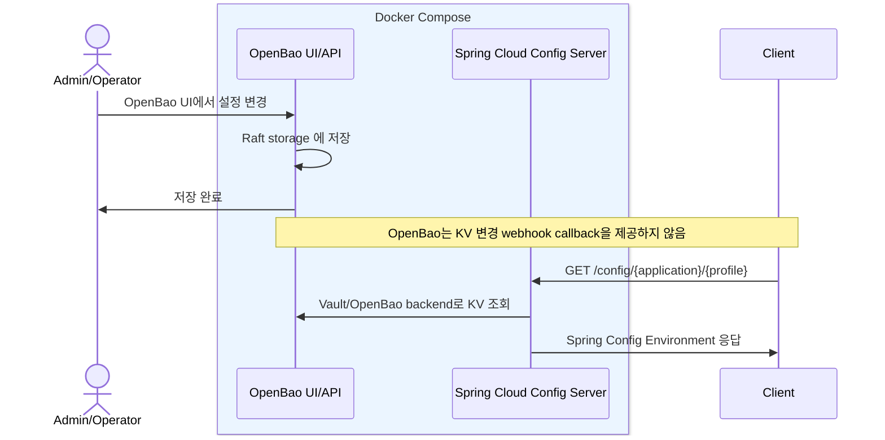

# my-spring-cloud-config

OpenBao를 설정 저장소와 관리자 UI로 사용하고, Spring Cloud Config 표준 API로 설정을 조회하는 common-config 서버입니다.

## Phase 1

- OpenBao 2.5.3을 KV v2 저장소와 관리자 UI로 사용합니다.
- common-config 서버는 Spring Cloud Config Server로 동작합니다.
- 설정 조회는 OpenBao KV v2의 latest 값만 대상으로 합니다.
- OpenBao version, created_time, audit 이력은 Spring Config 응답에 포함하지 않습니다.
- OpenBao는 KV 변경 webhook callback을 제공하지 않으므로 소비자가 명시적으로 조회합니다.



## 실행

```bash
docker compose -f docker/docker-compose.yml up -d --build
```

OpenBao UI:

```text
http://localhost:8200
```

OpenBao token:

```text
example
```

common-config Swagger:

```text
http://localhost:8085/swagger-ui.html
```

## 샘플 데이터

```bash
python3 docker/openbao/sample-config.py --create
```

삭제:

```bash
python3 docker/openbao/sample-config.py --clear
```

## 설정 조회

Spring Config Environment:

```http
GET http://localhost:8085/config/some-frontend/dev
```

포맷 변환 endpoint:

```http
GET http://localhost:8085/config/some-frontend-dev.json
GET http://localhost:8085/config/some-frontend-dev.yml
```

응답 예시:

```json
{
  "name": "some-frontend",
  "profiles": [
    "dev"
  ],
  "label": null,
  "version": null,
  "state": null,
  "propertySources": [
    {
      "name": "vault:some-frontend/dev",
      "source": {
        "feature-toggles.new-home": true,
        "feature-toggles.beta-search": true
      }
    }
  ]
}
```

## 문서

- [Agent notes](agent.md)
- [요구사항](docs/00-requirements.md)
- [솔루션 리서치](docs/01-solution-research.md)
- [초기 아키텍처](docs/02-architecture.md)
- [코드 컨벤션](docs/03-code-conventions.md)
