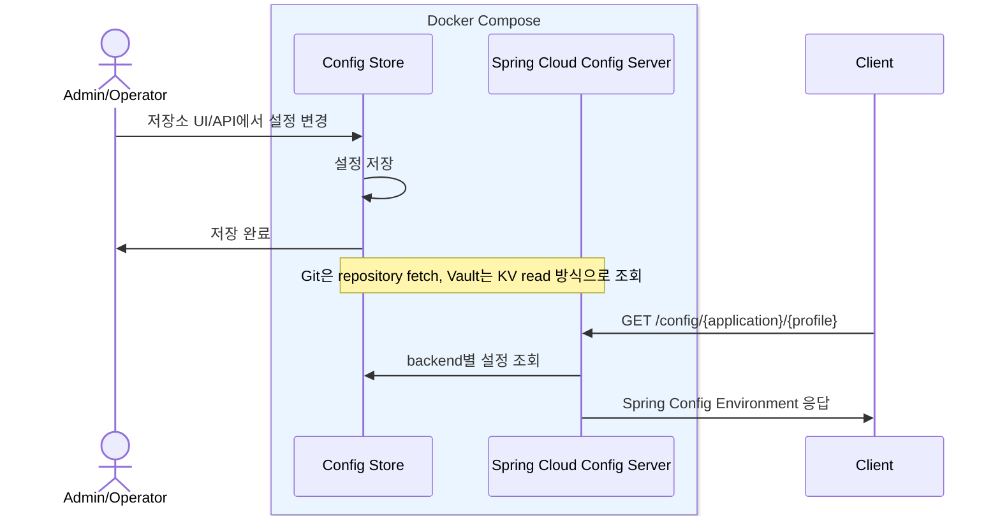
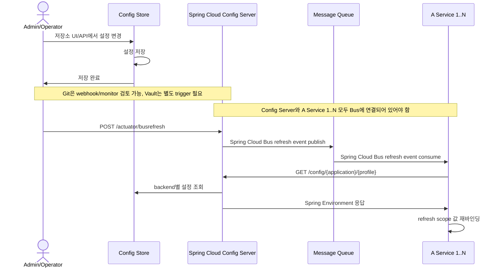

# my-spring-cloud-config

Git 또는 Vault-compatible 저장소를 사용하고, Spring Cloud Config 표준 API로 설정을 조회하는 common-config 서버입니다.

## Requirements

- Vercel, AWS, 관리형 DB, Git 서버 없이 온프레미스에서 실행할 수 있어야 합니다.
- 피쳐 토글을 첫 관리 도메인으로 시작하고, 이후 공통 설정 관리로 확장할 수 있어야 합니다.

## Architecture

| Concern         | Current                                       | Future                                                   |
|-----------------|-----------------------------------------------|----------------------------------------------------------|
| 온프레미스 설치        | 저장소와 common-config를 Docker Compose로 함께 실행     | K8s 배포 시 저장소 PVC를 연결하거나 저장소를 독립 운영                         |
| 관리자 UI          | 저장소가 제공하는 UI를 우선 사용                         | 별도 관리자 UI는 schema, 권한, 승인 흐름이 필요해질 때 추가                  |
| 설정 조회 API       | Spring Cloud Config 표준 API 사용                 | -                                                        |
| Feature flag 판단 | 서버가 evaluation하지 않고 소비 애플리케이션이 판단             | -                                                        |
| Version/history | Git commit 또는 Vault-compatible 저장소의 version/audit 사용 | 별도 facade가 필요해지면 응답 모델에 metadata projection 추가              |
| Runtime refresh | 명시적 fetch로 시작                                 | Spring 서비스는 Actuator/Bus, 비 Spring은 별도 client contract 검토 |



## Backend

| Backend profile | Backend type | Local implementation | Config file | Sample data |
|-----------------|--------------|----------------------|-------------|-------------|
| `git`           | Git repository | Gitea              | `application-git.yml` | `python3 docker/gitea/sample-config.py --create` |
| `vault`         | Vault-compatible KV | OpenBao        | `application-vault.yml` | `python3 docker/openbao/sample-config.py --create` |

## 설정 조회

로컬 확인은 [spring-config.http](app/common-config/http-client/spring-config.http) 활용을 권장합니다.

### 실행

```bash
# Git backend
docker compose -f docker/docker-compose.yml --profile git up -d --build
python3 docker/gitea/sample-config.py --create

# Vault backend
docker compose -f docker/docker-compose.yml --profile vault up -d --build
python3 docker/openbao/sample-config.py --create
```

Swagger UI:

```text
http://localhost:8085/swagger-ui.html
```

Backend UI:

```text
Git backend: http://localhost:3100
Vault backend: http://localhost:8200
```

Git backend 응답 예시:

```json
GET http://localhost:8085/config/some-frontend/dev

{
  "name": "some-frontend",
  "profiles": [
    "dev"
  ],
  "label": null, // Git branch/tag 조회에 사용. 생략하면 default label 사용
  "version": "430555036f793ecc9ed118d78eb2ce39ed76092a", // Git commit hash
  "state": "", // backend 추가 상태값. 현재 단계에서는 사용하지 않음
  "propertySources": [
    {
      "name": "http://localhost:3100/common-config/config-repo.git/some-frontend-dev.yml",
      "source": {
        "feature-toggles.new-home": true,
        "feature-toggles.beta-search": true
      }
    }
  ]
}
```

Vault backend 응답 예시:

```json
GET http://localhost:8085/config/some-frontend/dev

{
  "name": "some-frontend",
  "profiles": [
    "dev"
  ],
  "label": null, // Git branch/tag 조회에 사용. Vault backend에서는 대응값 없음
  "version": null, // Vault KV version은 Spring Config 표준 응답에 포함되지 않음
  "state": null, // backend 추가 상태값. 현재 단계에서는 사용하지 않음
  "propertySources": [
    {
      "name": "vault:some-frontend/dev",
      "source": {
        "feature-toggles.new-home": true,
        "feature-toggles.beta-search": true
      }
    }
  ]
}
```

## Phase 2

Git backend를 추가하고, 실행 profile로 backend를 선택합니다. Gitea는 로컬 Git 구현체입니다.

```bash
SPRING_PROFILES_ACTIVE=local,git
SPRING_PROFILES_ACTIVE=onprem,git
```

## Phase 1

Vault backend를 먼저 지원했습니다. 이때는 backend 선택 분기 없이 Vault-compatible 저장소만 대상으로 했습니다.

## Future: Spring Runtime Refresh

Spring 서비스의 runtime refresh가 필요해지면 Actuator refresh와 Spring Cloud Bus를 검토합니다.

- 단일 인스턴스는 `POST /actuator/refresh`로 설정을 재조회합니다.
- 스케일아웃 환경은 Spring Cloud Bus로 refresh 이벤트를 전파합니다.
- Git backend는 webhook/monitor 연계를 검토할 수 있고, Vault backend는 refresh trigger가 별도로 필요합니다.
- Config Server와 대상 Spring 서비스 모두 Spring Cloud Bus dependency와 broker 설정이 필요합니다.
- `POST /actuator/busrefresh`는 설정 값을 push하지 않고, 각 서비스가 재조회하도록 refresh 이벤트만 전파합니다.
- Bus 이벤트를 받은 서비스는 Spring Cloud Config Client 흐름으로 `/config/{application}/{profile}`을 다시 조회합니다.



## 문서

- [요구사항](docs/00-requirements.md)
- [솔루션 리서치](docs/01-solution-research.md)
