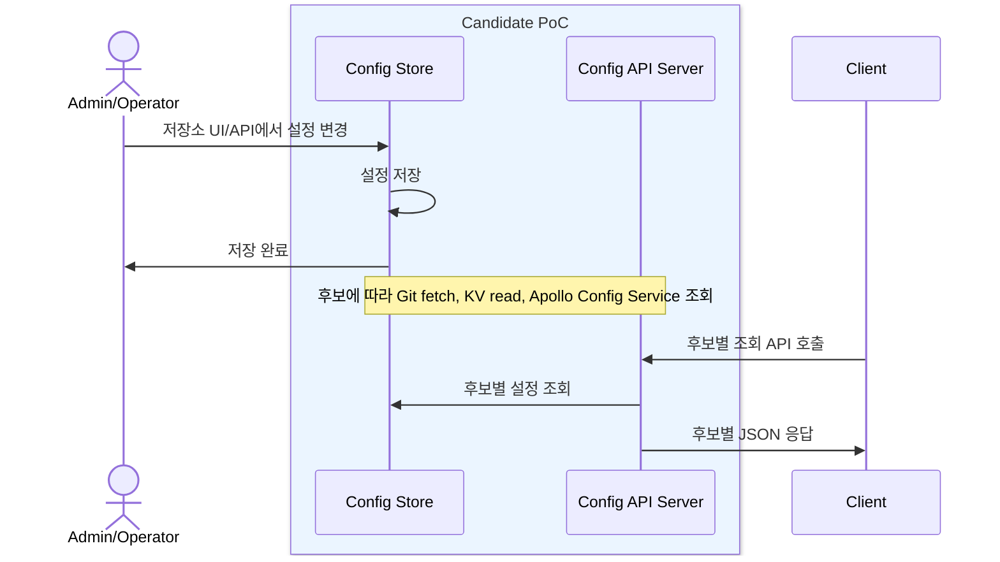
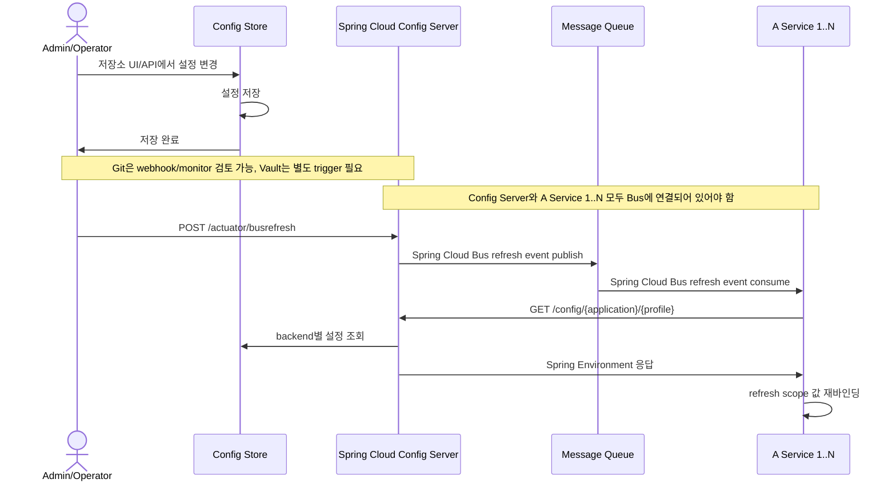

# my-spring-cloud-config

공통 설정 관리 서버를 설계하기 위한 리서치/PoC 준비 문서입니다. 아직 Spring Cloud Config, Git backend, Vault backend, Apollo 중 어느 방식도 구성 완료된 전제로 보지 않습니다.

## Requirements

- Vercel, AWS, 관리형 DB, Git 서버 없이 온프레미스에서 실행할 수 있어야 합니다.
- 피쳐 토글을 첫 관리 도메인으로 시작하고, 이후 공통 설정 관리로 확장할 수 있어야 합니다.

## Architecture

| Concern         | PoC에서 검토할 방향                                      | 후속 검토                                                   |
|-----------------|---------------------------------------------------|----------------------------------------------------------|
| 온프레미스 설치        | 저장소/설정 관리 제품과 조회 서버를 로컬 compose로 검증할 수 있어야 함       | K8s 배포 시 저장소 PVC를 연결하거나 저장소를 독립 운영                         |
| 관리자 UI          | 별도 UI를 만들기 전 저장소나 설정 관리 제품이 제공하는 UI를 우선 검토        | schema, 권한, 승인 흐름이 필요해질 때 별도 관리자 UI 추가                  |
| 설정 조회 API       | 후보별 API shape 비교: Spring Config `Environment`, Apollo API 등 | 실제 소비자가 필요한 JSON shape 확정                                   |
| Feature flag 판단 | 서버가 evaluation하지 않고 소비 애플리케이션이 판단하는 단순 모델부터 검토     | entitlement/team targeting 필요 시 별도 evaluation API 검토             |
| Version/history | Git commit, Vault-compatible version/audit, Apollo release 모델 비교 | 응답 모델에 metadata projection이 필요한지 검토                           |
| Runtime refresh | 명시적 fetch, SDK polling/long polling 등 후보별 방식 비교          | Spring 서비스는 Actuator/Bus, 비 Spring은 polling/ETag/SSE 등 검토       |



## Backend 후보

| Backend profile | Backend type | Local implementation | Config file | Sample data |
|-----------------|--------------|----------------------|-------------|-------------|
| `git`           | Git repository | Gitea              | `application-git.yml` | `python3 docker/gitea/sample-config.py --create` |
| `vault`         | Vault-compatible KV | OpenBao        | `application-vault.yml` | `python3 docker/openbao/sample-config.py --create` |

## Alternative: Apollo

Apollo는 Spring Cloud Config backend가 아니라 Portal/Admin/Config Service와 DB를 포함한 별도 설정 관리 제품입니다. 조회 API를 제로베이스에서 잡는다면 Apollo SDK 또는 HTTP API를 직접 쓰는 쪽이 자연스럽고, Spring Config `Environment` 응답 shape는 필요할 때만 facade로 추가 검토합니다.

핵심 차이는 조회 차원입니다. Spring Cloud Config는 `application / profile` 중심이고 `label`은 cluster가 아니라 version label입니다. Apollo는 `appId / clusterName / namespaceName`을 API에 직접 노출하므로 회사의 `application / profile / cluster` 모델에 더 잘 맞습니다.

자세한 조사 내용은 [Apollo 대안 리서치](docs/02-apollo-alternative.md)를 봅니다.

## Spring Cloud Config 후보 메모

아래 내용은 Spring Cloud Config를 후보로 둘 때의 API shape와 실행 흐름 예시입니다. 현재 구성 완료 상태를 뜻하지 않습니다.

### 실행 예시

```bash
# Git backend
docker compose -f docker/docker-compose.yml --profile git up -d --build
python3 docker/gitea/sample-config.py --create

# Vault backend
docker compose -f docker/docker-compose.yml --profile vault up -d --build
python3 docker/openbao/sample-config.py --create
```

Swagger UI 예시:

```text
http://localhost:8085/swagger-ui.html
```

Backend UI 예시:

```text
Git backend: http://localhost:3100
Vault backend: http://localhost:8200
```

Git backend 응답 예시:

```json
GET http://localhost:8085/config/some-frontend/dev

{
  "name": "some-frontend",
  "profiles": [
    "dev"
  ],
  "label": null, // Git branch/tag 조회에 사용. 생략하면 default label 사용
  "version": "430555036f793ecc9ed118d78eb2ce39ed76092a", // Git commit hash
  "state": "", // backend 추가 상태값. 현재 단계에서는 사용하지 않음
  "propertySources": [
    {
      "name": "http://localhost:3100/common-config/config-repo.git/some-frontend-dev.yml",
      "source": {
        "feature-toggles.new-home": true,
        "feature-toggles.beta-search": true
      }
    }
  ]
}
```

Vault backend 응답 예시:

```json
GET http://localhost:8085/config/some-frontend/dev

{
  "name": "some-frontend",
  "profiles": [
    "dev"
  ],
  "label": null, // Git branch/tag 조회에 사용. Vault backend에서는 대응값 없음
  "version": null, // Vault KV version은 Spring Config 표준 응답에 포함되지 않음
  "state": null, // backend 추가 상태값. 현재 단계에서는 사용하지 않음
  "propertySources": [
    {
      "name": "vault:some-frontend/dev",
      "source": {
        "feature-toggles.new-home": true,
        "feature-toggles.beta-search": true
      }
    }
  ]
}
```

## Spring Cloud Config + Git 후보

Git backend를 선택하면 Gitea 같은 self-hosted Git forge를 로컬 Git 저장소로 둘 수 있습니다.

```bash
SPRING_PROFILES_ACTIVE=local,git
SPRING_PROFILES_ACTIVE=onprem,git
```

## Spring Cloud Config + Vault-compatible 후보

Vault-compatible backend를 선택하면 OpenBao 같은 KV 저장소를 후보로 둘 수 있습니다.

## Future: Spring Runtime Refresh

Spring 서비스의 runtime refresh가 필요해지면 Actuator refresh와 Spring Cloud Bus를 검토합니다.

- 단일 인스턴스는 `POST /actuator/refresh`로 설정을 재조회합니다.
- 스케일아웃 환경은 Spring Cloud Bus로 refresh 이벤트를 전파합니다.
- Git backend는 webhook/monitor 연계를 검토할 수 있고, Vault backend는 refresh trigger가 별도로 필요합니다.
- Config Server와 대상 Spring 서비스 모두 Spring Cloud Bus dependency와 broker 설정이 필요합니다.
- `POST /actuator/busrefresh`는 설정 값을 push하지 않고, 각 서비스가 재조회하도록 refresh 이벤트만 전파합니다.
- Bus 이벤트를 받은 서비스는 Spring Cloud Config Client 흐름으로 `/config/{application}/{profile}`을 다시 조회합니다.



## 문서

- [요구사항](docs/00-requirements.md)
- [솔루션 리서치](docs/01-solution-research.md)
- [Apollo 대안 리서치](docs/02-apollo-alternative.md)
