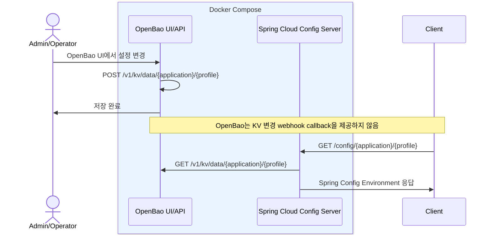
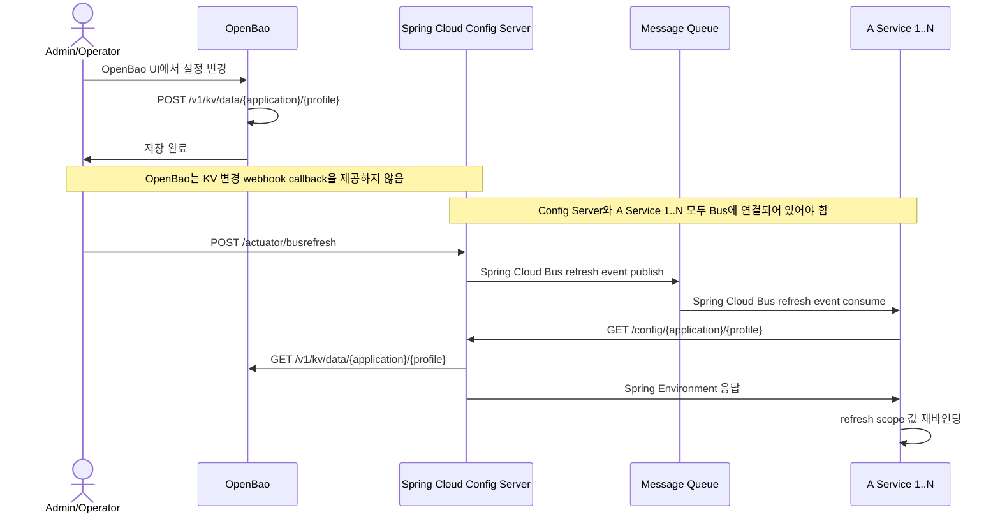

# my-spring-cloud-config

OpenBao를 설정 저장소와 관리자 UI로 사용하고, Spring Cloud Config 표준 API로 설정을 조회하는 common-config 서버입니다.

## Requirements

- Vercel, AWS, 관리형 DB, Git 서버 없이 온프레미스에서 실행할 수 있어야 합니다.
- 피쳐 토글을 첫 관리 도메인으로 시작하고, 이후 공통 설정 관리로 확장할 수 있어야 합니다.

## Phase 1

- OpenBao를 KV v2 저장소와 관리자 UI로 사용합니다.
- common-config 서버는 Spring Cloud Config Server로 동작합니다.
- 설정 조회는 OpenBao KV v2의 latest 값만 대상으로 합니다.
- OpenBao version, created_time, audit 이력은 Spring Config 응답에 포함하지 않습니다.



## 실행

```bash
# Docker Compose
docker compose -f docker/docker-compose.yml up -d --build

# 샘플 데이터 생성
python3 docker/openbao/sample-config.py --create

# 샘플 데이터 삭제
python3 docker/openbao/sample-config.py --clear
```

## 설정 조회

로컬 확인은 [spring-config.http](app/common-config/http-client/spring-config.http) 활용을 권장합니다.

Swagger UI:

```text
http://localhost:8085/swagger-ui.html
```

OpenBao UI:

```text
http://localhost:8200
```

```json
GET http://localhost:8085/config/some-frontend/dev

{
  "name": "some-frontend",
  "profiles": [
    "dev"
  ],
  "label": null, // Git branch/tag용. Vault/OpenBao 대응값 없음
  "version": null, // Git commit hash용. OpenBao KV version은 path별 metadata
  "state": null, // backend 추가 상태용. Vault/OpenBao backend는 보통 미사용
  "propertySources": [
    {
      "name": "vault:some-frontend/dev",
      "source": {
        "feature-toggles.new-home": true,
        "feature-toggles.beta-search": true
      }
    }
  ]
}
```

## Future: Spring Runtime Refresh

Spring 서비스의 runtime refresh가 필요해지면 Actuator refresh와 Spring Cloud Bus를 검토합니다.

- 단일 인스턴스는 `POST /actuator/refresh`로 설정을 재조회합니다.
- 스케일아웃 환경은 Spring Cloud Bus로 refresh 이벤트를 전파합니다.
- OpenBao는 KV 변경 webhook callback을 제공하지 않으므로 refresh trigger는 별도로 필요합니다.
- Config Server와 대상 Spring 서비스 모두 Spring Cloud Bus dependency와 broker 설정이 필요합니다.
- `POST /actuator/busrefresh`는 설정 값을 push하지 않고, 각 서비스가 재조회하도록 refresh 이벤트만 전파합니다.
- Bus 이벤트를 받은 서비스는 Spring Cloud Config Client 흐름으로 `/config/{application}/{profile}`을 다시 조회합니다.



## 문서

- [요구사항](docs/00-requirements.md)
- [솔루션 리서치](docs/01-solution-research.md)
