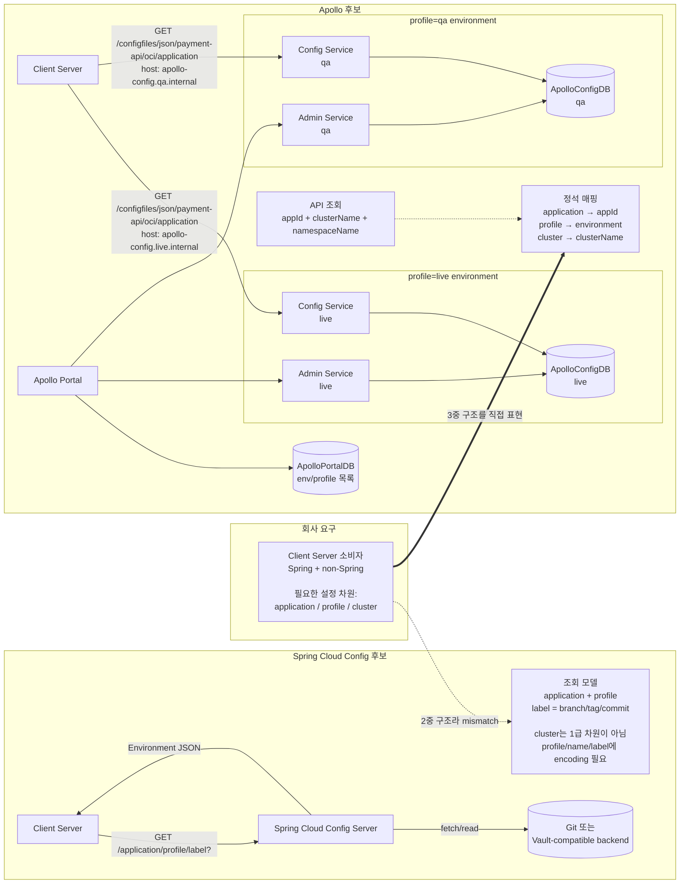
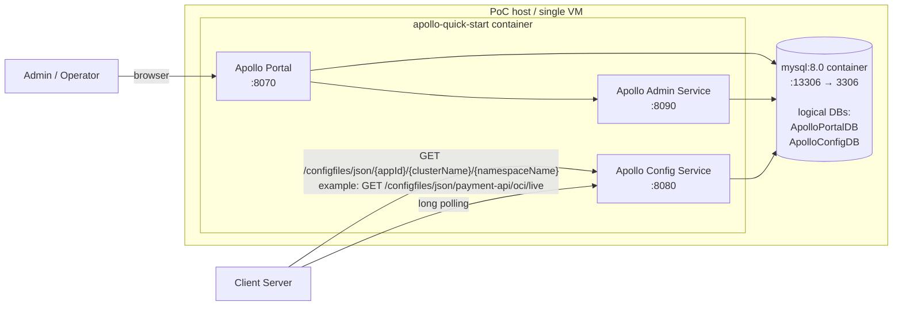

# Apollo 대안 리서치

## 요약

핵심은 회사 설정 모델이 **`application / profile / cluster` 3중 구조**라는 점입니다.

Apollo는 Spring Cloud Config의 backend가 아니라 **독립형 설정 관리 제품**입니다.

- `application / cluster` 표현은 Apollo가 더 직접적입니다.
- 하지만 `profile`을 Apollo environment로 매핑하면 profile별 Config Service/Admin Service/ConfigDB 운영이 필요할 수 있습니다.
- 단일 서버로 가볍게 쓰려면 `profile`을 `namespaceName`에 넣는 우회가 필요합니다.

| 항목 | Spring Cloud Config | Apollo | 판단 |
|------|---------------------|--------|------|
| 호출 예시 | ✅ `GET /{application}/{profile}` | ⚠️ `GET https://apollo-config.internal/configfiles/json/{application}/{clusterName}/{profile}` | 단일 endpoint는 유지됩니다.<br/>대신 Apollo namespace를 profile로 쓰는 trade-off가 있습니다. |
| 구성 복잡도 | ✅ Config Server dependency<br/>✅ backend 연결 | Portal/Admin/Config Service/DB까지 운영 | 단순 PoC나 Spring 중심 구성에서는 Spring Config가 더 가볍습니다. |
| Spring 생태계 궁합 | ✅ Spring Config Client<br/>✅ Actuator refresh<br/>✅ Spring Cloud Bus | Apollo Java client/config-data<br/>또는 HTTP API 별도 검증 | 기존 Spring Actuator/Bus 기반 refresh 흐름을 살리려면 Spring Config가 더 자연스럽습니다. |

### 파라미터 정석 의미와 회사 3중 구조 매핑

| 회사 차원 | Spring Cloud Config | Apollo |
|-----------|---------------------|--------|
| `application` | ✅ `application`<br/>설정 조회 대상 애플리케이션 | ✅ `appId`<br/>설정 조회 대상 애플리케이션 |
| `profile` | ✅ `profile`<br/>Spring profile/env 조합 | ⚠️ 정석: `environment`<br/>- Config Service/Admin Service/ConfigDB 분리 기준<br/>⚠️ 단일 서버 우회: `namespaceName`<br/>- 예: `live`, `qa` |
| `cluster` | ❌ 정석 파라미터 없음<br/>`label`은 branch/tag/commit | ✅ `clusterName`<br/>IDC, zone, 배포군 구분 |
| 설정 도메인 | 설정 key/file 구조로 표현 | ✅ 정석: `namespaceName`<br/>- 예: `application`, `feature-flags`<br/>⚠️ profile을 namespace로 쓰면 `live.application`처럼 이름에 encoding |

아래 Mermaid 다이어그램은 두 후보의 구조 차이와 Apollo 정석 배포에서 profile별 운영 단위가 늘어나는 지점을 비교합니다.

## 아키텍처 비교



Apollo에서 `profile`을 정석적인 environment로 매핑하면, 위 다이어그램처럼 `live`, `qa` 같은 profile마다 Config Service, Admin Service, ApolloConfigDB 운영 단위가 분리됩니다. Portal과 ApolloPortalDB는 공통으로 둘 수 있지만, 클라이언트 설정 조회 endpoint와 설정 저장 DB는 profile별로 늘어납니다. 경량 PoC에서는 이 구조 대신 단일 Apollo endpoint에서 `namespaceName`을 profile로 쓰는 우회안을 검토합니다.

## Apollo Quick Start PoC 아키텍처

초기 PoC는 상용 분산 배포가 아니라 Quick Start에 가까운 단일 서버 구성이면 충분합니다.



- 서비스 프로세스는 1개 컨테이너 안에서 Portal, Config Service, Admin Service를 포트만 다르게 띄웁니다.
- DB도 물리적으로 2대가 아니라 같은 MySQL 컨테이너 안에 `ApolloPortalDB`, `ApolloConfigDB` 두 논리 DB/schema를 둡니다.
- 이 구성은 PoC용입니다. 운영형 분산 배포에서는 Portal/Admin/Config Service와 ConfigDB를 환경별로 분리할 수 있습니다.

## Spring Cloud Config 방식과 Apollo 방식의 차이

| Concern | Spring Cloud Config 방식 | Apollo 방식 | 판단 |
|---------|--------------------------|-------------|------|
| 제품 경계 | Spring Cloud Config Server + Git/OpenBao backend | ✅ Apollo Portal/Admin/Config Service + DB | Apollo가 더 완성된 설정 관리 제품입니다. Spring Cloud Config backend만 바꾸는 접근과는 제품 경계가 다릅니다. |
| 조회 차원 | `application` + `profile` 중심. `label`은 version/branch 성격 | ⚠️ `appId` + `clusterName` + `namespaceName` | profile별 Apollo env는 운영 단위가 늘어납니다. 단일 서버에서는 `namespaceName`을 profile로 쓰는 우회가 필요합니다. |
| 조회 API | Spring Cloud Config `Environment` JSON 응답 | ✅ Apollo SDK 또는 `/configs`, `/configfiles` 계열 HTTP API | Spring 서버는 Apollo Java client/config-data 또는 HTTP API를 검토하고, non-Spring 소비자는 HTTP API를 우선 볼 수 있습니다. |
| 저장소 | ⚖️ Git 또는 Vault-compatible KV | ⚖️ ApolloConfigDB, ApolloPortalDB | Git commit 모델과 Apollo DB release 모델은 성격이 다릅니다. PR/review 중심이면 Git, 제품형 release/rollback이면 Apollo가 맞습니다. |
| 관리자 UI | Gitea/OpenBao 같은 backend UI 활용 가능 | ✅ Apollo Portal 기본 제공 | 별도 관리자 프론트를 만들지 않는 요구에는 Apollo Portal이 잘 맞습니다. |
| Version/history | ⚖️ Git commit 또는 Vault KV version/audit | ⚖️ release version, rollback | 설정 release/rollback은 Apollo 제품 기능이고, Git PR 기반 review는 Spring Config + Git 쪽이 자연스럽습니다. |
| Runtime update | 명시적 fetch, 이후 Actuator/Bus 검토 | ✅ SDK long polling push + 주기 polling fallback | Apollo가 runtime update 경험은 더 직접적으로 제공합니다. |
| Spring 생태계 궁합 | ✅ Spring Config Client, Actuator refresh, Spring Cloud Bus와 자연스럽게 연결 | Apollo Java client/config-data 또는 HTTP API를 별도로 검증 | 기존 Spring Actuator/Bus 기반 refresh 흐름을 살리려면 Spring Config가 더 자연스럽습니다. |
| Client Server 소비자 | Spring Cloud Config client 또는 HTTP 직접 조회 | ✅ Apollo Java client/config-data 또는 HTTP API | non-Spring 소비자를 함께 보면 Apollo HTTP API가 더 직접적입니다. |
| Feature flag | 서버가 evaluation하지 않고 소비자가 판단 | ✅ gray release, namespace, client-side config change listener | Apollo가 더 많은 config center 기능을 제공합니다. 다만 전용 feature flag evaluation 제품은 아니므로 entitlement/team targeting은 별도 설계가 필요합니다. |
| 구성 복잡도 | ✅ Spring Boot 앱에 `spring-cloud-config-server` dependency와 backend만 연결 | Quick Start도 Portal/Admin/Config Service/DB를 함께 운영 | 단순 PoC나 Spring 중심 구성에서는 Spring Config가 더 가볍습니다. |
| 실행/패키징 | ✅ Spring Boot 앱에 `spring-cloud-config-server` dependency와 `@EnableConfigServer`를 넣어 Config Server를 띄움 | Quick Start는 `apollo-quick-start` Docker image와 MySQL compose 제공. 분산 배포는 Portal/Admin/Config Service를 각각 JVM 서비스로 운영 | Apollo는 제품 서버들을 받아서 띄우는 쪽이고, Spring Config는 우리 Spring Boot 앱으로 서버를 만드는 쪽이라 Spring Config가 더 단순합니다. |

## Apollo 구성 요소

Apollo의 기본 흐름은 다음과 같습니다.

1. 운영자가 Portal에서 설정을 수정하고 release합니다.
2. Portal은 Admin Service를 통해 설정을 변경/발행합니다.
3. Config Service는 클라이언트 설정 조회와 변경 알림을 담당합니다.
4. 클라이언트는 Config Service에서 설정을 가져오고, long polling으로 변경을 감지합니다.

주요 모듈은 다음과 같습니다.

| Module | 역할 | 기본 포트/비고 |
|--------|------|----------------|
| Portal | 관리자 UI, Open API 진입점 | Quick Start 기준 `8070` |
| Admin Service | 설정 수정, release, rollback 등 관리 API | Quick Start 기준 `8090` |
| Config Service | 클라이언트 설정 조회, push notification, Meta Server/Eureka 포함 | Quick Start 기준 `8080` |
| ApolloPortalDB | Portal 자체 데이터와 환경 목록 | 운영에서는 보통 1개 |
| ApolloConfigDB | 앱/cluster/namespace/release/config 데이터 | 환경별 1개 권장 |

Apollo 문서 기준 서버 측 DB는 `ApolloPortalDB`와 `ApolloConfigDB` 두 개입니다. 다만 이것은 **논리 DB/schema가 2개**라는 뜻이지 반드시 DB 서버 2대가 필요하다는 뜻은 아닙니다. PoC나 작은 배포에서는 같은 MySQL 인스턴스 안에 두 DB를 둘 수 있고, 운영에서는 `ApolloPortalDB`는 보통 1개, `ApolloConfigDB`는 환경별로 분리합니다.

Docker 관점에서는 Quick Start가 `apollo-quick-start` 컨테이너 하나에 Config Service, Admin Service, Portal을 같이 띄우고, 별도 `mysql:8.0` 컨테이너를 붙이는 compose를 제공합니다. 운영형 분산 배포에서는 Config Service, Admin Service, Portal을 각각 배포 단위로 보고 JVM 서비스로 운영합니다.

반대로 Spring Cloud Config Server는 별도 완제품 서버를 Docker로 받는 모델이 아니라, Spring Boot 애플리케이션에 `spring-cloud-config-server` dependency와 `@EnableConfigServer`를 넣어서 직접 서버 앱을 띄우는 모델입니다.

### Spring Config + Git 후보보다 필요한 구성 요소가 많은 이유

`Apollo 서비스 구성이 필요하다`는 말은 Git 저장소만 붙이면 되는 구조가 아니라는 뜻입니다. Apollo는 Git backend가 아니라 설정 관리 제품 전체를 제공하므로, 설정 조회 서버와 관리자 서버, UI, DB가 함께 필요합니다.

Spring Cloud Config + Git backend 후보의 흐름은 단순합니다.

```text
Client -> Spring Cloud Config Server -> Git repository
```

- Git repository가 설정 원본입니다.
- Spring Cloud Config Server는 Git을 fetch/clone해서 Spring Config `Environment` 응답으로 변환합니다.
- Gitea를 선택하더라도 Spring Config 입장에서는 일반 Git remote입니다. Gitea UI/API는 Git 저장소 운영을 편하게 해주는 계층입니다.

Apollo 흐름은 다릅니다.

```text
Client -> Apollo Config Service -> ApolloConfigDB
Admin/Operator -> Apollo Portal -> Apollo Admin Service -> ApolloConfigDB
Apollo Portal -> ApolloPortalDB
```

- Config Service가 클라이언트 설정 조회와 변경 알림을 담당합니다.
- Admin Service가 설정 수정, release, rollback 같은 관리 작업을 담당합니다.
- Portal이 관리자 UI입니다.
- DB가 설정 원본이자 release/version 저장소입니다.

따라서 Apollo를 채택한다는 것은 `Spring Config Server의 backend를 Git에서 Apollo로 바꾼다`가 아니라, `Apollo라는 별도 config center를 운영하고 소비자가 Apollo API spec을 쓰게 한다`에 가깝습니다. `/config/{application}/{profile}` API는 Apollo 위에 별도 facade를 둘 때의 선택지입니다.

## 3중 구조 적합성

회사 모델은 다음처럼 봅니다.

```text
application / profile / cluster
예: payment-api / live / oci
```

Spring Cloud Config의 기본 Environment 조회 모델은 `application`, `profile`, `label`입니다.

- `application`: `spring.application.name`
- `profile`: `spring.profiles.active`
- `label`: Git branch/tag/commit 같은 backend version label

따라서 `label`은 cluster로 쓰기 어렵습니다. cluster를 억지로 표현하려면 `profile=live,oci`, `application=payment-api-oci`, `label=oci` 같은 encoding을 해야 하는데, 이 경우 cluster가 독립 차원으로 관리되지 않고 profile/version/application 이름에 섞입니다.

Apollo는 cluster를 1급 개념으로 둡니다. 다만 profile을 Apollo environment로 매핑하면 profile별 Config Service/Admin Service/ConfigDB 운영 단위가 생길 수 있어 경량 PoC 관점에서는 큰 단점입니다. profile별 서버를 피하려면 단일 Apollo environment 안에서 `namespaceName`을 profile로 사용하는 우회가 필요합니다.

- Portal에서 app 아래 cluster를 생성할 수 있습니다.
- HTTP API path에 `clusterName`이 직접 들어갑니다.
- 공식 HTTP API도 `GET /configfiles/json/{appId}/{clusterName}/{namespaceName}`와 `GET /configs/{appId}/{clusterName}/{namespaceName}` 형태입니다.
- Apollo 문서는 IDC/서버룸별 설정처럼 cluster별 설정 요구를 cluster 생성으로 해결한다고 설명합니다. 회사 모델에서는 `oci`, `airgap` 같은 실행 환경군을 cluster로 봅니다.

회사 모델과 Apollo 모델은 아래처럼 매핑할 수 있습니다.

| 회사 모델 | Apollo 모델 | 비고 |
|-----------|-------------|------|
| `application` | `appId` | 서비스/애플리케이션 식별자 |
| `profile` | `namespaceName` 또는 Apollo environment | 경량 구성에서는 `live`, `qa` 같은 profile을 namespace로 둡니다. Apollo environment로 두면 profile별 서버/DB 운영 단위가 늘어납니다. |
| `cluster` | `clusterName` | `oci`, `airgap` 같은 실행 환경군 |
| 설정 도메인 | namespace naming convention | profile을 namespace로 쓰면 설정 도메인은 `live.application`, `live.feature-flags`처럼 namespace 이름에 함께 encoding합니다. |

결론: **Apollo는 `application / cluster` 표현은 Spring Cloud Config보다 직접적이지만, `profile`을 Apollo environment로 분리해야 한다면 경량 요구에서는 Spring Cloud Config가 더 유리합니다.**

단일 Apollo 서버를 유지하는 호출 예시는 다음처럼 둡니다.

```text
GET https://apollo-config.internal/configfiles/json/{application}/{clusterName}/{profile}
예: GET https://apollo-config.internal/configfiles/json/payment-api/oci/live
```

## 조회 API spec

제로베이스에서 봐야 할 것은 **각 후보가 어떤 JSON shape를 제공하는지**입니다. Spring Cloud Config 방식은 `Environment` 응답을 반환하고, Apollo의 Config Service API는 Apollo 고유 응답을 반환합니다.

### Spring Cloud Config `Environment` 응답 예시

Spring Cloud Config 방식을 API spec으로 삼으면 조회 응답은 다음 형태입니다.

```text
GET /config/{application}/{profile}
```

```json
{
  "name": "{application}",
  "profiles": [
    "{profile}"
  ],
  "label": null,
  "version": "430555036f793ecc9ed118d78eb2ce39ed76092a",
  "state": "",
  "propertySources": [
    {
      "name": "git:config-repo/{application}-{profile}.yml",
      "source": {
        "feature-toggles.new-home": true,
        "feature-toggles.beta-search": true
      }
    }
  ]
}
```

이 응답은 `application/profile`을 기준으로 여러 `propertySources`를 합성하고, backend revision은 `version`, branch/tag는 `label`에 싣는 Spring Cloud Config 모델입니다.

### Apollo HTTP 응답 예시

Apollo의 캐시 기반 JSON 조회는 namespace의 설정 key/value만 바로 반환합니다.

```text
GET https://apollo-config.{profile}.internal/configfiles/json/{application}/{clusterName}/{namespaceName}
```

```json
{
  "feature-toggles.new-home": "true",
  "feature-toggles.beta-search": "true"
}
```

`properties`가 아닌 namespace는 원문 payload를 `content` 필드에 담습니다.

```text
GET https://apollo-config.{profile}.internal/configfiles/json/{application}/{clusterName}/datasources.json
```

```json
{
  "content": "{\"url\":\"jdbc:mysql://mysql:3306/app\"}"
}
```

releaseKey 기반의 non-cache 조회는 metadata와 설정을 함께 반환합니다.

```text
GET https://apollo-config.{profile}.internal/configs/{application}/{clusterName}/{namespaceName}?releaseKey={releaseKey}
```

```json
{
  "appId": "{application}",
  "cluster": "{clusterName}",
  "namespaceName": "{namespaceName}",
  "configurations": {
    "feature-toggles.new-home": "true",
    "feature-toggles.beta-search": "true"
  },
  "releaseKey": "{newReleaseKey}"
}
```

releaseKey가 서버의 최신 값과 같으면 HTTP `304 Not Modified`와 빈 body를 반환할 수 있습니다.

변경 감지는 별도 long polling endpoint를 사용합니다.

```text
GET https://apollo-config.{profile}.internal/notifications/v2?appId={application}&cluster={clusterName}&notifications=[{"namespaceName":"{namespaceName}","notificationId":100}]
```

```json
[
  {
    "namespaceName": "{namespaceName}",
    "notificationId": 101
  }
]
```

변경이 없으면 서버가 요청을 최대 60초 hold한 뒤 HTTP `304 Not Modified`를 반환합니다. 변경이 있으면 HTTP `200 OK`와 변경된 namespace의 최신 `notificationId`를 반환하고, 클라이언트는 다시 `/configs` 또는 `/configfiles`를 호출해 값을 가져옵니다.

### API shape 차이

| Concern | Spring Cloud Config facade 후보 | Apollo Config Service |
|---------|----------------------------------|-----------------------|
| 기본 조회 단위 | `application` + `profile` | `appId` + `cluster`; `namespaceName`은 기본 `application`으로 고정 가능 |
| 대표 endpoint | `GET /config/{application}/{profile}` | `GET /configfiles/json/{appId}/{clusterName}/{namespaceName}` 또는 `GET /configs/{appId}/{clusterName}/{namespaceName}` |
| response wrapper | `name`, `profiles`, `label`, `version`, `state`, `propertySources[]` | key/value JSON 또는 `appId`, `cluster`, `namespaceName`, `configurations`, `releaseKey` |
| 설정 map 위치 | `propertySources[].source` | 최상위 key/value 또는 `configurations` |
| revision 표현 | Git backend는 `version`에 commit hash, Vault backend는 제한적 | `releaseKey` |
| 변경 감지 | 명시적 fetch, 이후 Actuator/Bus 검토 | `/notifications/v2` long polling + `/configs` 재조회 |

제로베이스 기준으로는 Apollo SDK/HTTP API를 직접 쓰는 선택지가 가장 단순합니다. Spring Cloud Config `Environment` JSON은 Spring Config 생태계의 응답 shape가 필요할 때만 별도 facade로 제공하면 됩니다.

### Java/Spring

Apollo Java client는 framework에 독립적이고 Spring/Spring Boot 통합을 지원합니다.

Spring Boot 2.4+에서는 Config Data Loader 방식으로 다음과 같은 형태를 사용할 수 있습니다.

```properties
spring.config.import=apollo://application
```

Meta Server 또는 Config Service 주소는 `apollo.meta`, `APOLLO_META`, `apollo.config-service`, `APOLLO_CONFIG_SERVICE` 등으로 지정할 수 있습니다.

### HTTP 직접 조회

비 Java 클라이언트나 별도 HTTP consumer는 Apollo HTTP API로 설정을 조회할 수 있습니다.

- 캐시 사용 JSON 조회: `GET {config_server_url}/configfiles/json/{appId}/{clusterName}/{namespaceName}?ip={clientIp}`
- releaseKey 기반 조회: `GET {config_server_url}/configs/{appId}/{clusterName}/{namespaceName}?releaseKey={releaseKey}&messages={messages}&label={label}&ip={clientIp}`
- 변경 감지: notifications를 넘기는 long polling API를 사용하고, 서버는 최대 60초 동안 hold 후 변경 여부를 반환합니다.

Apollo API 응답은 Spring Cloud Config `Environment` 응답과 다릅니다. 제로베이스에서는 Apollo 응답 shape를 그대로 쓰면 되고, Spring Config 모양의 응답이 필요한 별도 이유가 있을 때만 adapter/facade를 추가합니다.

## PoC 구현 선택지

### 선택지 A: Apollo를 별도 실험 앱/compose로 분리

가장 안전한 탐색 방식입니다.

- Spring Cloud Config 후보와 Apollo 후보를 같은 PoC에 섞지 않습니다.
- Apollo quick start 또는 자체 compose를 `docker/apollo/`처럼 분리합니다.
- README와 docs에는 Apollo 실행/비교 절차만 추가합니다.
- 이후 실제 채택 판단 전까지 Spring Cloud Config 실험과 Apollo 실험을 분리합니다.

Gradle 관점에서는 Apollo 자체가 외부 서비스라서 반드시 멀티 프로젝트일 필요는 없습니다. 다만 Apollo facade나 비교용 client를 만들게 되면 `:app:apollo-facade`, `:samples:apollo-client`처럼 별도 subproject로 분리할 수 있습니다.

### 선택지 B: 별도 Apollo facade를 둠

Spring Cloud Config `Environment` 응답 shape를 별도로 제공하고 싶을 때의 선택입니다.

- `GET /config/{application}/{profile}` 같은 facade endpoint를 제공합니다.
- 내부에서 Apollo Config Service HTTP API를 조회합니다.
- Apollo의 `appId/cluster/namespace`를 facade의 `application/profile` 표현으로 매핑합니다.
- Spring Cloud Config `label/version/state/propertySources`로 projection합니다.

이 방식은 Spring Config 모양의 HTTP 응답을 제공할 수 있지만, Apollo SDK의 hot update 장점은 약해집니다. 또한 Apollo releaseKey, notificationId, namespace format을 Spring Config 응답에 어떻게 담을지 설계가 필요합니다.

### 선택지 C: 소비자가 Apollo API spec을 직접 사용

Apollo를 제품으로 온전히 쓰는 방식입니다.

- Spring 서비스는 Apollo Java client/config-data를 사용합니다.
- Node/Python 등은 공식/커뮤니티 SDK 또는 HTTP API를 사용합니다.
- 별도 facade 서버는 만들지 않거나, 필요한 projection API가 생길 때만 추가합니다.

이 방식은 Apollo의 runtime update와 Portal 기능을 가장 잘 활용합니다. 조회 API를 제로베이스에서 설계한다면 우선 검토할 기본 선택지입니다.

## 요구사항 기준 1차 판단

Apollo는 다음 요구에는 강합니다.

- 온프레미스/self-hosted 설정 관리
- 관리자 UI 기본 제공
- release/rollback/version 관리
- Java/Spring runtime update
- 비 Spring HTTP 조회 경로
- Open API를 통한 자동화

반대로 다음은 추가 설계가 필요합니다.

- Spring Cloud Config API shape를 별도 facade로 제공할 필요가 있는지
- Git PR 기반 review 흐름
- Vault/secret manager 수준의 secret 관리와 audit
- `local/dev/qa/live` 같은 profile과 `oci/airgap` 같은 cluster를 Apollo env/cluster/namespace에 어떻게 매핑할지
- `entitledTeamIds` 기반 feature flag evaluation/targeting
- PostgreSQL 기반 로컬 인프라 재사용

따라서 현 시점의 추천은 **Apollo를 별도 대안으로 문서화하고, PoC는 Apollo direct API 기준으로 분리해 진행**하는 것입니다. Spring Config 응답 facade는 실제로 그 JSON shape가 필요해졌을 때 추가 검토합니다.

## 후속 검증 체크리스트

구현으로 넘어가기 전에 아래를 결정해야 합니다.

- `/config/{application}/{profile}` 형태의 facade API가 필요한지
- Apollo `appId`, `cluster`, `namespace`, `env`와 facade를 둘 때의 `application`, `profile`, `label` 매핑
- release/review 권한 모델: Apollo Portal 권한만 쓸지, Git PR 흐름이 필요한지
- feature flag entitlement/team targeting을 Apollo 설정값으로만 둘지, 별도 evaluation API를 둘지
- 운영 DB를 MySQL로 새로 둘지, H2 quick start만으로 PoC를 끝낼지
- Docker Compose 포트 계획: Apollo quick start 기본 포트는 `8070/8080/8090/13306`입니다.

## 참고 자료

- Apollo GitHub: https://github.com/apolloconfig/apollo
- Apollo Quick Start: https://www.apolloconfig.com/#/zh/deployment/quick-start
- Apollo Docker Quick Start: https://www.apolloconfig.com/#/zh/deployment/quick-start-docker
- Apollo Deployment Architecture: https://www.apolloconfig.com/#/zh/deployment/deployment-architecture
- Apollo Distributed Deployment Guide: https://www.apolloconfig.com/#/zh/deployment/distributed-deployment-guide
- Apollo Java SDK Guide: https://www.apolloconfig.com/#/zh/client/java-sdk-user-guide
- Apollo Other Language HTTP Client Guide: https://www.apolloconfig.com/#/zh/client/other-language-client-user-guide
- Apollo Open API Platform: https://www.apolloconfig.com/#/zh/portal/apollo-open-api-platform
