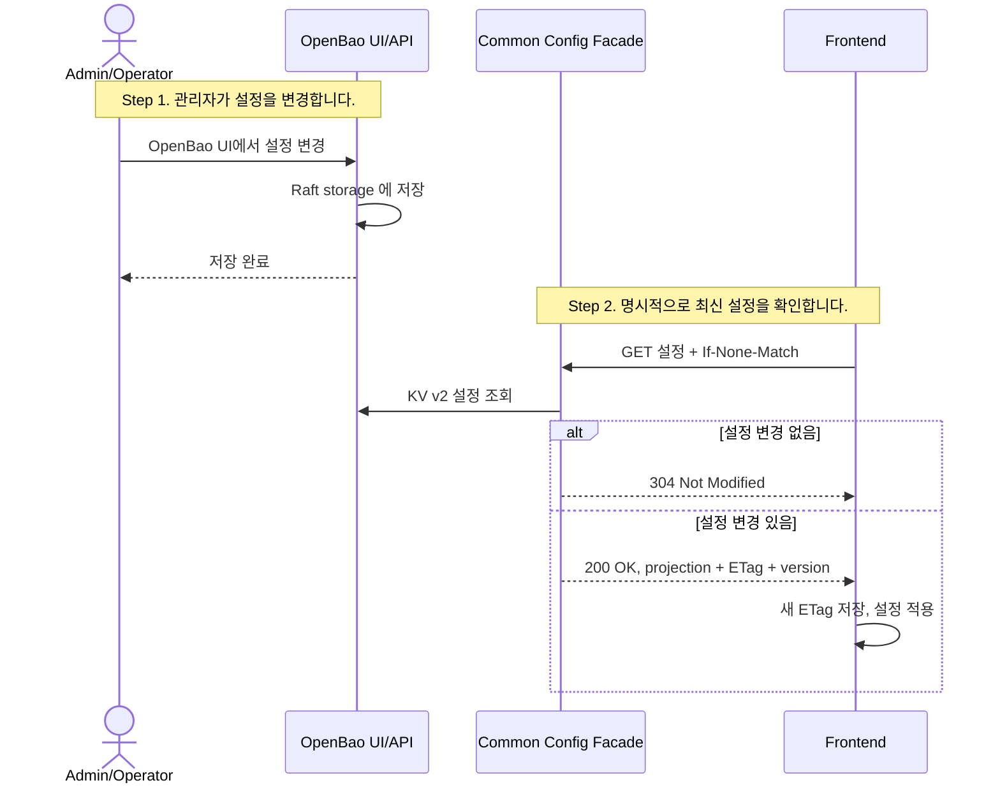

# 초기 아키텍처

## 기술 스택

Java 25, Kotlin 2.x, Spring Boot 4, OpenBao 2.5.3, Kotest

## 목표 구조

```text
Admin / Operator
    |
    | OpenBao UI
    v
OpenBao                              // UI, KV v2 버전 이력, audit, policy/token, self-hosted 저장소
    +--> Spring Cloud Config Server  // Spring 서비스는 공식 Vault/OpenBao backend로 설정 조회
    +--> Common Config Facade        // 프론트 projection API, 검증, ETag/version 응답

Spring services --> Spring Cloud Config Server
Frontend --> Common Config Facade
```

## Phase 1 Sequence



## 배포 목표

on-prem 환경에서는 Docker Compose 하나로 OpenBao와 common-config 서버를 함께 실행합니다.

```text
docker compose --profile app up -d
```

- `openbao`: OpenBao 서버.
- `common-config`: Spring Cloud Config Server와 프론트 projection API를 포함하는 Spring Boot/Kotlin 서버.
- `openbao-data`: OpenBao Raft 데이터를 저장하는 Docker volume.

## OpenBao Storage

OpenBao는 **Integrated Storage(Raft)** 를 사용합니다. Docker Compose에서는 named volume, K8s에서는 PVC로 데이터를 유지합니다.

## Phase 1 완료 기준

- Docker Compose 한 파일로 OpenBao와 common-config 서버를 실행합니다.
- OpenBao UI에서 설정을 생성/수정하고 이력을 확인할 수 있습니다.
- 프론트는 Common Config Facade를 통해 명시적으로 최신 설정을 가져올 수 있습니다.
- Spring 서비스는 Spring Cloud Config Server의 Vault/OpenBao backend로 설정을 조회합니다.
