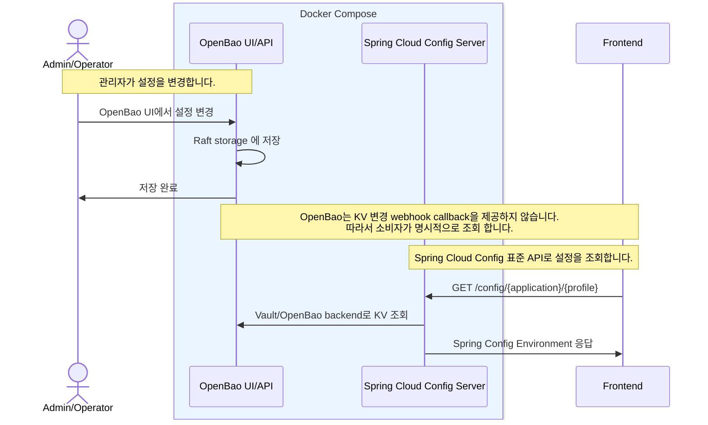
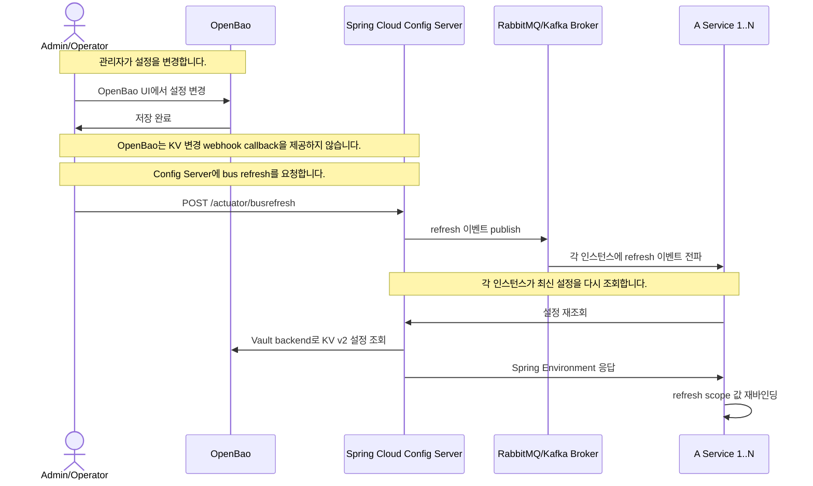

# Architecture

## Phase 1

Phase 1은 OpenBao를 설정 저장소와 관리자 UI로 사용하고, common-config 서버는 Spring Cloud Config 표준 API를 제공하는 조회 서버로 둡니다.

- 설정 조회는 OpenBao KV v2의 latest 값만 대상으로 합니다.
- OpenBao version, created_time, audit 이력은 Spring Config 응답에 포함하지 않습니다.



```json
GET /config/{name}/{profiles}
GET /config/some-frontend/dev

{
  "name": "some-frontend", // 요청 application
  "profiles": [
    "dev" // 요청 profile
  ],
  "label": null, // Git branch/tag용. Vault/OpenBao 대응값 없음
  "version": null, // Git commit hash용. OpenBao KV version은 path별 metadata
  "state": null, // backend 추가 상태용. Vault/OpenBao backend는 보통 미사용
  "propertySources": [ // n개 가능. Spring Config가 우선순위대로 병합
    {
      "name": "vault:some-frontend/dev", // Spring Config property source 이름. vault 출처 표시
      "source": {
        "feature-toggles.new-home": true, // OpenBao KV 값을 flat property로 변환
        "feature-toggles.beta-search": true
      }
    }
  ]
}
```

## Future: Spring Runtime Refresh

- Spring 서비스는 Spring Cloud Config Server로 설정을 조회합니다.
- OpenBao는 KV 변경 webhook callback을 제공하지 않으므로 별도 refresh trigger가 필요합니다.


