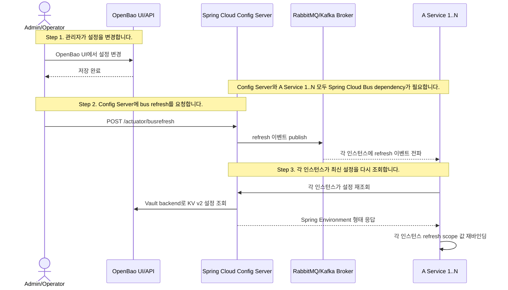

# Future Runtime Refresh

### Spring Services

- Spring 서비스는 Spring Cloud Config Server로 설정을 조회하는 방향을 검토합니다.
- 초기에는 부트타임 조회를 우선 고려하고, 런타임 반영이 필요해지면 Actuator refresh를 붙입니다.
- 단일 인스턴스는 `POST /actuator/refresh`로 최신 설정을 다시 가져오게 할 수 있습니다.
- 스케일 아웃된 인스턴스들은 Spring Cloud Bus를 붙여 refresh 이벤트를 전파하는 방향을 검토합니다.

### Node.js/Python Services

- Node.js/Python 서비스는 HTTP API와 ETag 조건부 요청으로 설정을 조회하는 방향을 검토합니다.
- 기본 확장은 polling + ETag 조건부 요청입니다.
- 변경 즉시성 요구가 커지면 SSE를 추가로 검토합니다.
- Webhook이나 message broker는 온프레미스 설치 부담이 커서 초기 후보에서 제외합니다.
